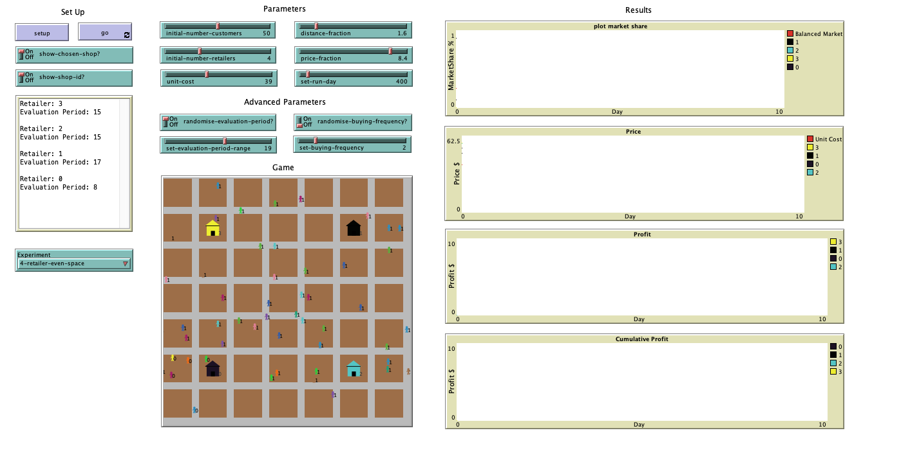
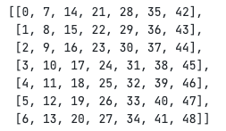

# Experiment Guidline

## Setup and Parameters

**Experiment Version Game setup**

### Set up

- `setup` - Set up the game with paramised values
- `go` - Run the game until the tick is stopped
- `show-chosen-shop` - Display the current customer's retailer preference
- `show-shop-id` - Display the retailer ID

### Basic parameters setup include:

- `inital-number-customers`: Number of customers
- `initial-number-retailers`: Number of retailers
- `unit-cost`: Cost of a product
- `distance-fraction`: Sensitivity of distance between customer and retailer shop
- `price-fraction`: Sentitivity of price between retailers
- `set-run-day`: Number of days to run the experiment

### Advanced parameters setup include:

- `randomise-evaluation-period?` (Switch)

  - `On` - Randomise evaluation period for each retailer
  - `Off` - Fix evaluation period for each retailer

- `set-evaluation-period-range` (Slider)

  - If `randomise-evaluation-period?` is `On`, generate random evaluation period between 5 to slider value. Otherwise, each retailer has fixed evaluation period of slider value

- `randomise-buying-frequency?` (Switch)

  - `On` - Randomise buying frequency for each customer
  - `Off` - Fix buying frequency for each customer

- `set-buying-frequency` (Slider)
  - If 'randomise-buying-frequency? is `On`, generate random frequency between 1 to slider value. Otherwise, each customer has fixed buying frequency of slider value

## Experiment Chooser

1. `Customised` - User can set up the game with different parameters
2. `2-retailer-even-space` - Pre-defined 2 retailers with equally spaced in the game
3. `3-retailer-even-space` - Pre-defined 3 retailers with equally spaced in the game
4. `4-retailer-even-space` - Pre-defined 4 retailers with equally spaced in the game

**The game grid is defined as follow:**

